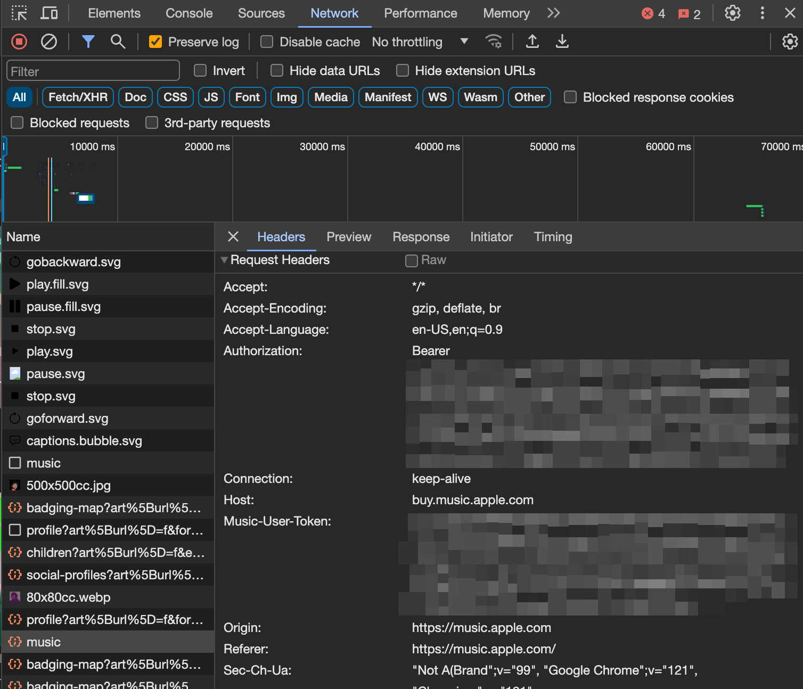

# Spotify to Apple Music
## Based on the work of [@simonschellaert](https://github.com/simonschellaert/spotify2am)
Import your Spotify playlist to Apple Music **for free** using Python!

## Usage
### 1. Export your Spotify Playlist to a CSV file
The first step is getting the songs you want to import into Apple Music into a CSV file. The simplest way to do this is to use [Exportify](https://watsonbox.github.io/exportify/).  
You just need to login using your Spotify account, and all the playlists that you have saved in your library should appear. Then export the CSV file of the playlist you want to convert and save it in the same directory as the directory where you cloned the repo.

### 2. Match the Spotify songs with their Apple Music identifier and upload them to Apple Music
To upload your converted IDs to an Apple Music playlist, you'll need 5 things:
- The list of Apple Music identifiers (iTunes identifiers) for each song in your Spotify playlist
- Your Apple Music Authorization (Bearer Token)
- Your Apple Music Medi-User-Token
- Your session cookies

Here's a step by step to get all of this data:
1. To get the list of Apple Music identifiers, all you got to do is get the file you downloaded from [Exportify](https://watsonbox.github.io/exportify/).
2. You can get all the other data using your favorite browser. Fire it up and open the [Apple Music web player](https://music.apple.com). 
3. Open DevTools (**Ctrl + Shift + I or Cmd + Opt + I**) and go to the Network tab. 
4. Then you'll need to log in to your account. If you're already logged in, please log out and log in again. 
5. Go back to the DevTools and look for a GET request to *https://buy.music.apple.com/account/web/info* (It seems like there are 2 requests to this URL; it should be the second one).
6. In the **Requests Headers**, copy the **Authorization**, the **Media-User-Token** and the **Cookies**.

7. Now you're finally ready to connvert your songs and push them onto your Apple Music playlist. To do so, open a terminal and run the following:
```bash
python3 convertsongs.py yourplaylist.csv
```
or
```bash
python3 convertsongs.py playlistdir 
```
(Replace *yourplaylist.csv* by your own filename, the one you got from [Exportify](https://watsonbox.github.io/exportify/), or *playlistdir* by your own playlist directory name.)

Follow the script prompt, and when asked, paste in each data. If your terminal have a paste character limit: please hardcode them.

## Limitations & Notes
### iTunes StoreFront Region
Please note that the current script is configured on the iTunes StoreFront of **France**. So if you're from a different region, please don't forget to replace your ISO Code inside the base URL (line 37) with the one associated with your region. Full list of ISO Code, provided by Wikipedia, [here](https://en.wikipedia.org/wiki/ISO_3166-1_alpha-2).
### Missing songs
The script to retrieve the Apple Music identifier for a Spotify song is quite basic. It simply compares the title, artist, and album name in many different combinations of search terms. The goal is to match an Apple Music song with your Spotify song and then get their iTunes identifier (it's the same as Apple Music identifiers). Some songs don't have the exact same title, artist, or album name (extraneous spacing, for example) in both services. This results in the script failing to retrieve an identifier for some songs. Hopefully, you'll be able to add the missing songs manually thanks to the **noresult.txt** file.
### Coming from version 1.1 or older ?
If you're coming from version 1.1 or older, `getitunesid.py` and `addsongs.py` has been merged to create `convertsongs.py`. You can still find the old scripts in the [Archive folder](archive). If you need more instructions on how to use the old scripts, the old README is still available [here](archive/OLDREADME.md). Please note that the old scripts are not maintained anymore. 
## This repository is under the [Apache License 2.0](LICENSE)
